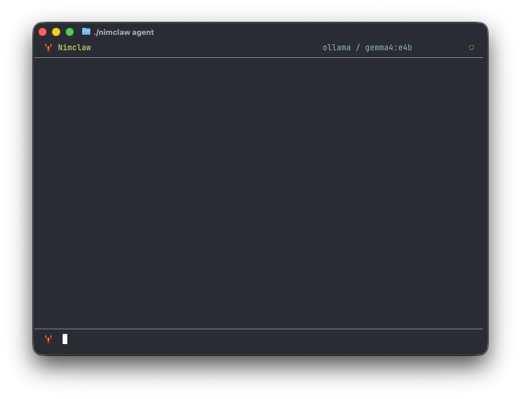

# NimClaw 🦞

[](https://opensource.org/licenses/MIT)
[](https://nim-lang.org)
[](https://github.com/bung87/nimclaw/actions/workflows/ci.yml)
[](https://github.com/bung87/nimclaw/stargazers)



Ultra-efficient AI assistant in Nim. A high-performance implementation inspired by Nimclaw.

## Features
- Independent implementations of all channels (Telegram, Discord, QQ, Feishu, DingTalk, WhatsApp, MaixCam).
- Powerful toolset: filesystem, shell, web, cron, spawn.
- <10MB RAM footprint.
- Zero heavy dependencies for channels.

## Installation

### Prerequisites
- Nim >= 2.0.0
- nimble

### Build from Source

```bash
# Clone the repository
git clone https://github.com/bung87/nimclaw.git
cd nimclaw

# Install dependencies and build
nimble build -d:release

# Or compile directly
nim c -d:release src/nimclaw.nim
```

### Quick Start

```bash
# 1. Initialize configuration
./nimclaw onboard

# 2. Edit config at ~/.nimclaw/config.json
#    Add your LLM API keys (OpenAI, Anthropic, OpenRouter, etc.)
#    Enable desired channels (Telegram, Discord, etc.)

# 3. Start the gateway (all enabled channels)
./nimclaw gateway

# 4. Or use interactive CLI mode
./nimclaw agent "Hello, what can you do?"
```

### Commands

| Command | Description |
|---------|-------------|
| `onboard` | Create initial configuration |
| `agent [message]` | Run interactive agent or single query |
| `gateway` | Start message gateway with all channels |

#### TUI Mode Commands

When running in interactive TUI mode (without a message argument), the following commands are available:

| Command | Description |
|---------|-------------|
| `/new` | Create a new session (clears conversation history) |
| `quit`, `exit`, `q` | Exit the application |

### Configuration

Edit `~/.nimclaw/config.json`:

```json
{
  "agents": {
    "defaults": {
      "workspace": "~/.nimclaw/workspace",
      "model": "gpt-4",
      "provider": "openai",
      "max_tokens": 8192,
      "temperature": 0.7,
      "max_tool_iterations": 20
    }
  },
  "providers": {
    "openai": {
      "api_key": "sk-...",
      "api_base": "https://api.openai.com/v1"
    }
  },
  "channels": {
    "telegram": {
      "enabled": true,
      "token": "YOUR_BOT_TOKEN",
      "allow_from": []
    }
  },
  "gateway": {
    "host": "0.0.0.0",
    "port": 18790
  },
  "tools": {
    "web": {
      "search": {
        "api_key": "",
        "max_results": 5
      }
    }
  }
}
```

#### Configuration Fields

| Section | Field | Description | Default |
|---------|-------|-------------|---------|
| `agents.defaults` | `workspace` | Agent workspace directory | `~/.nimclaw/workspace` |
| `agents.defaults` | `model` | Default LLM model | `glm-4.7` |
| `agents.defaults` | `provider` | Explicit provider (`openai`, `anthropic`, `ollama`, `zhipu`, `kimi`, `groq`, `gemini`, `openrouter`, `vllm`) | `zhipu` |
| `agents.defaults` | `max_tokens` | Maximum tokens per response | `8192` |
| `agents.defaults` | `temperature` | Sampling temperature | `0.7` |
| `agents.defaults` | `max_tool_iterations` | Max tool call loops per request | `20` |
| `providers.{name}` | `api_key` | API key for the provider | `""` |
| `providers.{name}` | `api_base` | Custom base URL for the provider | Provider-specific default or `""` |
| `channels.*` | `enabled` | Enable the channel | `false` |
| `channels.*` | `allow_from` | Allowed sender IDs (empty = allow all) | `[]` |
| `gateway` | `host` | Gateway bind address | `0.0.0.0` |
| `gateway` | `port` | Gateway port | `18790` |
| `tools.web.search` | `api_key` | Web search API key | `""` |
| `tools.web.search` | `max_results` | Max web search results | `5` |

Supported providers: `anthropic`, `openai`, `openrouter`, `groq`, `zhipu`, `vllm`, `gemini`, `kimi`, `ollama`.

## Skills

Skills extend nimclaw's capabilities by providing specialized knowledge and instructions.

### Installing Skills

Skills are installed locally in your workspace:

```bash
# Create skill directory
mkdir -p ~/.nimclaw/workspace/skills/my_skill

# Add SKILL.md file
cat > ~/.nimclaw/workspace/skills/my_skill/SKILL.md << 'EOF'
---
name: my_skill
description: My custom skill
---

# My Skill

Your skill content here...
EOF
```

### Skill Format

A skill is a directory containing a `SKILL.md` file:

```
~/.nimclaw/workspace/skills/
├── my_skill/
│   └── SKILL.md
└── another_skill/
    └── SKILL.md
```

The SKILL.md supports YAML frontmatter for metadata:
- `name`: Skill identifier
- `description`: Short description
- `author`: Author name
- `tags`: List of tags

### Built-in Skills

nimclaw includes example skills in the `skills/` directory:

```bash
# Copy example skill to your workspace
cp -r skills/example_skill ~/.nimclaw/workspace/skills/
```

### Using Skills

Once installed, skills are automatically loaded into the agent's context. The LLM can:

1. **Read skill files** using the `read_file` tool to access skill documentation
2. **Use skill knowledge** to perform specialized tasks

Skills are located at `~/.nimclaw/workspace/skills/{skill-name}/` and typically contain:
- `SKILL.md` - Main skill documentation and instructions
- Additional files (templates, examples, etc.)

To use a specific skill, simply ask the agent to use it:

```
You: Use the pm-product-strategy skill to analyze my product idea
Agent: [reads the skill files and applies the methodology]
```

### Installing Specific Skills from Monorepos

Some repos contain multiple skills in subdirectories (e.g., `phuryn/pm-skills`). Since GitHub API has rate limits, install specific skills like this:

```bash
# Install a specific skill from a subdirectory
./nimclaw skills --install phuryn/pm-skills/pm-product-strategy
./nimclaw skills --install phuryn/pm-skills/pm-data-analytics
```

Or clone the repo manually and install from local path:

```bash
# Clone the entire skills repo
git clone https://github.com/phuryn/pm-skills.git /tmp/pm-skills

# Install individual skills from local path
./nimclaw skills --from_path /tmp/pm-skills/pm-product-strategy
./nimclaw skills --from_path /tmp/pm-skills/pm-data-analytics
```
